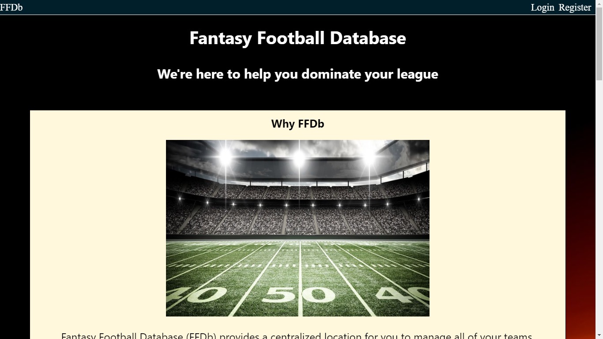
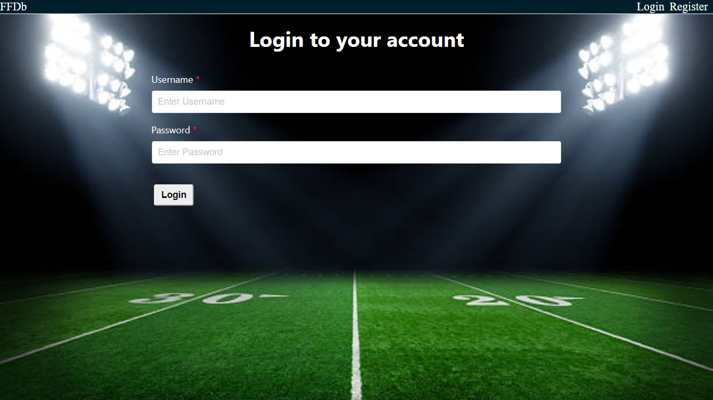
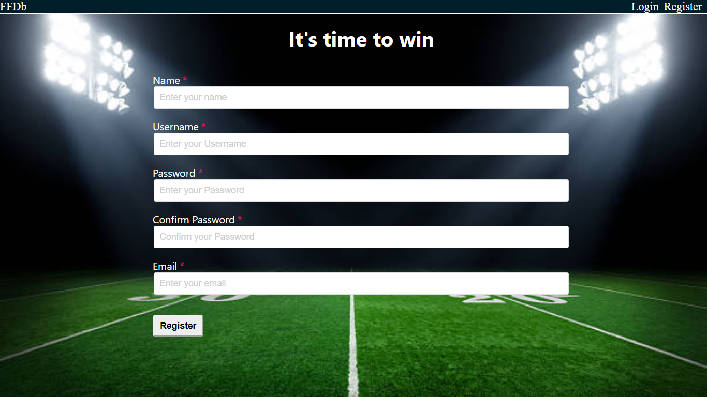
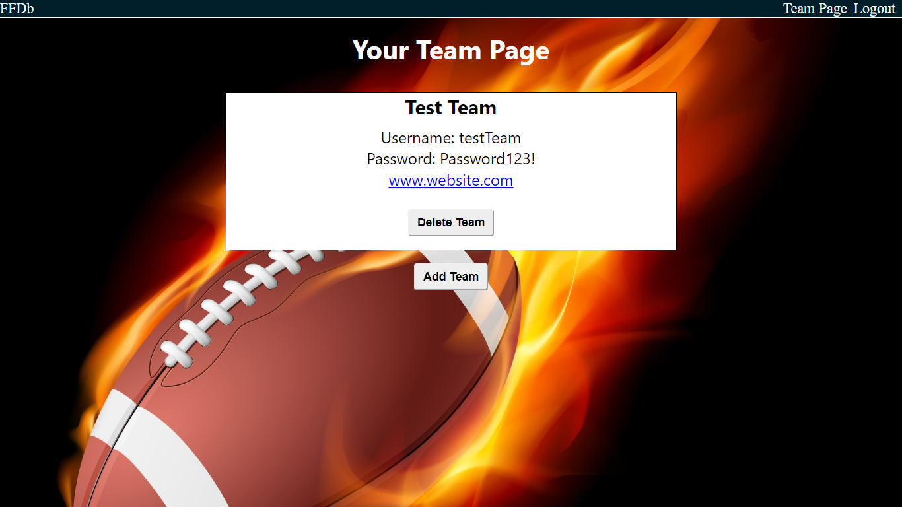
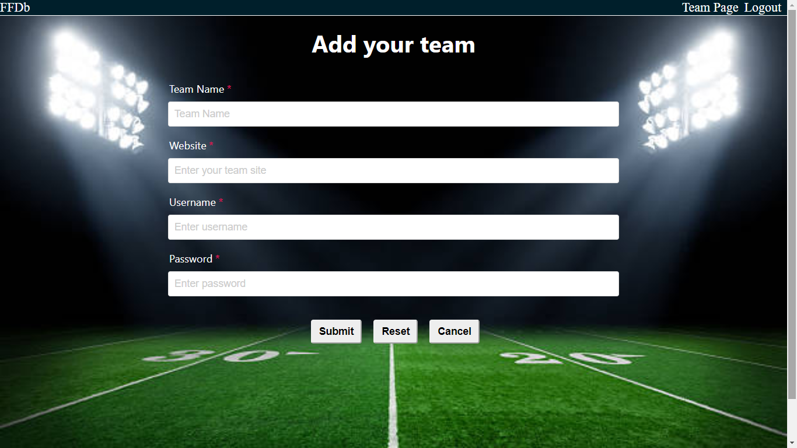

# Fantasy Football Database (FFDb)

The live link to the app is https://ffdb-app.now.sh/

## Screenshots

## About the app

This app was designed to create a central location for people who play fantasy football, and have teams on multiple platforms, to keep track of their login information and provide easy access to each team so you don't have to jump from site to site.  The goal of the app is to allow the user to be able to check scores and player information right from this app so they don't have to go from site to site to keep track of their team.

### Technology Used

This app was built using:
React
CSS
Node
Express
PostreSQL

